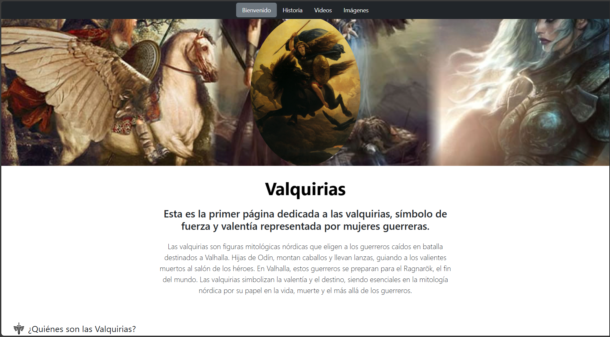
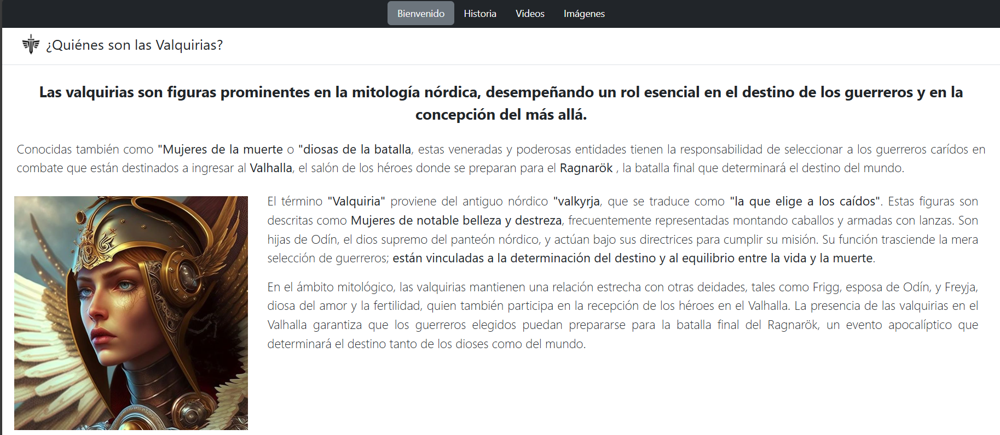
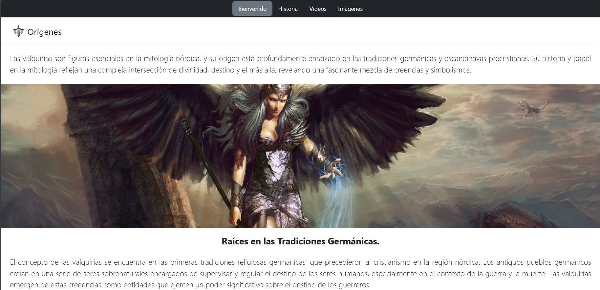
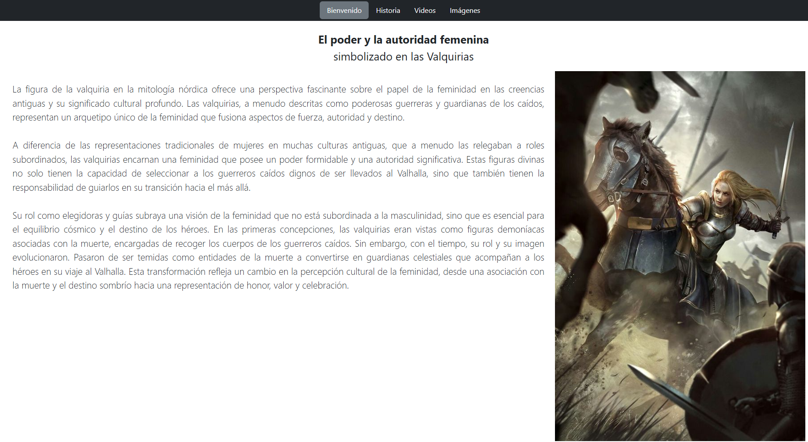

# Primer página web realizados en el Bootcamp TECHNOLOCHICAS PRO

El presente proyecto es mi primer página web realizada para poner en práctica las habilidades obtenidas dentro del bootcamp de desarrollo frontend de Technolochicas PRO como primer actividad del curso.

Fue desarrollado con HTML y CSS con el uso de el framework de UI, Bootstrap utilizando además bibliotecas externas.

La página es responsiva (adaptable a diferentes tamaños de pantalla) e incluye la presentación de la autora del proyecto.

[Proyecto Desplegado (https://mis-gustos-1er-pagina.vercel.app/)](https://mis-gustos-1er-pagina.vercel.app/)

## Secciones de mi sitio

## Tecnologías

* HTML
* CSS
* Bootstrap

---
Desarrollado con 💜 por [Vania Flores](https://github.com/VaniaFGtz/) en [TECHNOLOCHICAS PRO](https://tecnolochicas.mx/)

<!-- En este repositorio se almacena una página web básica acerca de mis gustos específicamente de una breve historia sobre las guerreras nórdicas -valquirias- historia y orígenes -->
